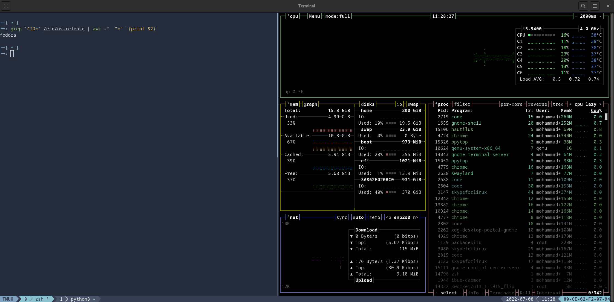

```
              ██████╗         ███████╗      ████████╗   ███████╗   ██╗   ██╗                  ███████╗   ███████╗
              ██╔══██╗   ██╔════██╗   ╚══██╔══╝   ██╔════╝   ██║   ██║                  ██╔════╝   ██╔════╝
              ██║      ██║   ██║            ██║            ██║            █████╗         ██║   ██║                  █████╗         ███████╗
              ██║      ██║   ██║            ██║            ██║            ██╔══╝         ██║   ██║                  ██╔══╝         ╚════██║
██╗     ██████╔╝   ╚███████╔╝            ██║            ██║                  ██║   ███████╗   ███████╗   ███████║
╚═╝     ╚═════╝         ╚══════╝               ╚═╝            ╚═╝                  ╚═╝   ╚══════╝   ╚══════╝   ╚══════╝
```

> personal dotfiles installer and configuration
> 
> There's no place like ~/

## Overview

  
An installer that incorporates some of the wonderful terminal programs, packages, and configurations that are commonly installed together.

## What's Included

| Feature                                                             | Description                                                                                   |
| ------------------------------------------------------------------- | --------------------------------------------------------------------------------------------- |
| [zsh](https://en.wikipedia.org/wiki/Z_shell)                        | a popular shell with features like completion, path correction, spelling correction, and more |
| [tmux](https://github.com/tmux/tmux)                                | terminal multiplexer allows you to manage multiple terminal sessions from a single window     |
| [neovim](https://neovim.io/)                                        | a project that seeks to aggressively refactor Vim                                             |
| [oh-my-zsh](https://github.com/robbyrussell/oh-my-zsh)              | a framework for managing your zsh configuration                                               |
| [vim-sensible](https://github.com/tpope/vim-sensible)               | vim settings everyone can agree on                                                            |
| [tmux-sensible](https://github.com/tmux-plugins/tmux-sensible)      | tmux settings everyone can agree on                                                           |
| [nord-tmux](https://github.com/arcticicestudio/nord-tmux)           | An arctic, north-bluish clean and elegant tmux color theme                                    |
| [nord-vim](https://github.com/arcticicestudio/nord-vim)             | An arctic, north-bluish clean and elegant Vim color theme                                     |
| [spaceship-prompt](https://github.com/denysdovhan/spaceship-prompt) | A zsh prompt for Astronauts                                                                   |

## Features

- Completions

- Auto-suggestions

- Command validation

- Directory history

- Git feedback

- Terminal multiplexing

- Window tabbing

- Nord theming

- Persistence

## Supported Platforms

- Fedora 💚
- Ubuntu
- Debian
- Arch Linux

## Install

``` bash
sh -c "$(wget -q https://raw.githubusercontent.com/mohammadne/dotfiles/master/install.sh -O -)"
```

## Uninstall

``` bash
sh -c "$(wget -q https://raw.githubusercontent.com/mohammadne/dotfiles/master/uninstall.sh -O -)"
```

## key bindings

- Opening VIM
- Exiting VIM
- Save without quitting
- Move with h,j,k,l
- Going into insert mode
- Going back to command mode
- dd for delete line
- Use arrow keys to move (not recommended)
- G and gg for top and bottom lines
- {,} to skip blocks of code
- Using numbers to loop command
- u for undo and redo
- Cntrl+r for redo
- yy for copying line 
- p for pasting line below
- P for pasting line above
- using dd to cut a line for pasting
- use V for visual line mode to select lines
- Do stuff with selected lines
- o for inserting the new line below
- O for inserting new line above
- d+<command> to delete characters
- w to jump forward words and b to jump backward
- :<num> to jump to specific line
- 0 for the beginning of the line and $ for the end of the line. 
- ^ for beginning word
- W for jumping forward a word (ignore punctuation)
- t+<char> and f+<char> to go to specific character in a line
- % to go to specific block parenthesis
- c+<command> for changing characters
- `D` to delete from cursor to end of line
- `*` to search for other instances
- `;` to go to the next instance of a character when using t,f
- `zz` to center your page based on the cursor's position
- `a` to insert from the right of the character, i to insert from left
- `A` to insert from the end of the line, I to insert from the beginning of the line
- x to delete a character which cursor is on
- ~ to change the case of a letter
- . to repeat the last executed command
- r to replace a letter, R to go to replace mode
- Commend combo to move a chunk of code from bottom to top
- Commend combo to wrap a chunk of code
- `>>` to indent line, `<<` to unindent
- macros
- Rafactoring example
- v for selecting chunks of characters
- Cntrl+v to select in a block format
- /<chars> to search for words in the document,n goto next occurrence
- Removing multiple occurrences using macros
- VScode Emulation
- Rebinding <Esc> in VSCode
- Chrome emulation

## Other awesome dotfiles repositories

- https://github.com/nicknisi/dotfiles

- https://github.com/1995parham/dotfiles

- https://github.com/NeuralNine/config-files